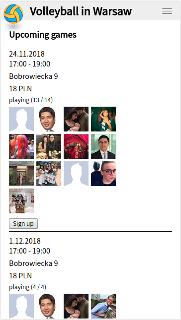
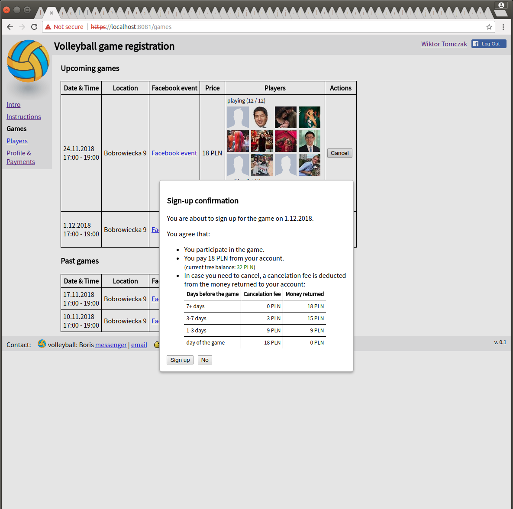

# Volleyball Games

**Volleyball Games** is an online platform for organizing volleyball games.
Specifically, it allows game organizers to propose games to players
and players to sign up for games, within the limit of free places.
Payments for games are managed automatically via each player's prepaid
money account.

The original motivation was to ensure the desired number of players
(typically 12 or 14) for the games we organize.

## Demo

https://volleyball-warsaw.tk:444 (staging instance)

## Screenshots

 

[All screenshots](doc/screenshots/)

## Functionality

* Game organizer (admin)
   * Logs in with their Facebook profile
   * Adds / edits / removes games, sets:
      * time
      * location
      * maximum number of players (free places)
      * price per player
      * link to Facebook event (optional)
   * Updates (corrects) players' payment record, 
     eg. credits their account after they paid in cash
   * TODO: Bank account

* Player
   * Logs in with their Facebook profile (auto-creates their vbreg profile)
   * Signs up for a game
   * Signs up for waiting list if a game has no free places
   * Deposits and withdraws money from their payment account
   * Sets / edits / clears profile information:
      * Email address
      * Bank account details
   * Receives email notifications (see below)

## Features

* Upcoming games and past games list; game information and actions
* Registered players list
* User authentication and profiles via Facebook login
* Waiting list with automatic sign-up should a place become free
* Email notifications to players:
   * When a new game is created
   * When a place is free in a previously full game
   * When a player is automatically signed up from waiting list
* Cancelation fees; fee customization based on time before the game
* Player and admin modes

## License

Source code in the [Volleyball Games](
https://github.com/wiktortomczak/volleyball-games) repository comes with
[GNU General Public License v3.0](LICENSE).

## Source code dependencies

### Open-source

[third_party](third_party/)

### Closed-source

Generic and infrastructure code from [iTrader.pl](https://itrader.pl).

TODO: Description and possible workarounds.

## Architecture

Web application:

* Frontend: single page web app, desktop and mobile versions
* Backend: API server
* Helper infrastructure:
   * Nginx web server (js app, css, html stub) and reverse proxy
   * Docker image

## Technologies

### Frontend

* ES6
* React
* Closure library
* Closure compiler

### Backend

* Python
* gflags

### Shared

* gRPC
* Protocol buffers
* Nginx
* Docker
* Bazel

## Technical features

* Single-page web application
* React used for view (DOM rendering) only, model decoupled from React components
* Automatic real-time synchronization of API (backend) data in the frontend, 
  via streaming web gRPC call
   * Auto-reconnect on stream termination
   * Warning if opening the stream takes too long
* Changes of API (backend) state and data via web gRPC calls
* API (backend) state persisted in a text proto file
* Shared frontend-backend configuration via compiled-in proto
* Facebook login via Facebook SDK
* Desktop vs mobile layout via CSS alone (no special handling in JS code)
* In-browser pop-ups with confirmation / error message after user actions, 
  using `<dialog>`
* Rendering of formatted backend errors with user-understandable messages 
  via UserVisibleException
* If logged in, redirect to games view by default
* Testing:
   * Scope and environment
      * Frontend only (JS only), localhost
      * End-to-end (frontend + backend + FB), localhost
      * End-to-end, code under test in Docker container
      * Staging
   * A few testing data sets

## Instructions

## Build 

TODO

### Run

TODO

### Test

[browserstack](https://www.browserstack.com)
